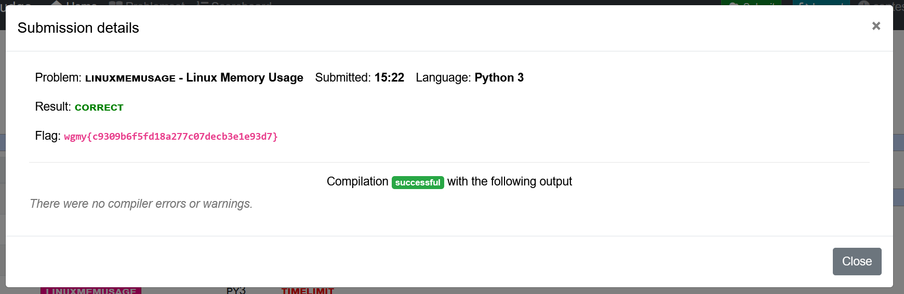

# Linux Memory Usage - CTF Challenge Writeup

## Challenge Information
- **Name**: Linux Memory Usage
- **Category**: PPC / Leet Code
- **Objective**: The objective of the "Linux Memory Usage" CTF challenge is to efficiently manage and process memory usage data for different processes based on given inputs.

## Solution
Encountering a Leet Code challenge within a CTF was an interesting experience. Here's how I tackled it:

1. **Understanding Inputs**:
   - This was my first encounter with a Leet Code style challenge in a CTF context, very very fun.
   - The problem consisted of three types of inputs:
     1. Variables N and Q: Representing the number of processes and queries.
     2. Processes' Data: Including process id, parent process id, and memory usage.
     3. Queries: Containing necessary information for further analysis.

2. **Memory Mapping**:
   - Utilizing the received inputs, I structured the memory by creating a dictionary.
   - The dictionary's key-value pairs were organized to represent parent processes and their corresponding children processes, facilitating efficient data retrieval.

3. **Handling Queries**:
   - Processing queries involved reading and parsing the data structure I coded to provide the desired output efficiently.

      

## Flag
The flag for this challenge is: `wgmy{XXXXXXXXXX}`.

This writeup demonstrates the process of efficiently managing and processing memory usage data in the "Linux Memory Usage" CTF challenge using appropriate data structures and systematic query handling. For any further inquiries or clarifications, feel free to ask.
