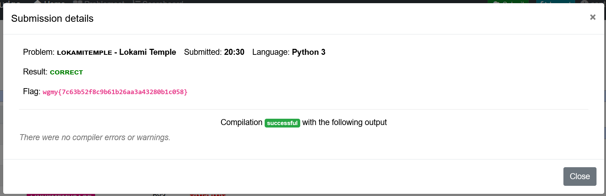

# Lokami Temple - CTF Challenge Writeup

## Challenge Information
- **Name**: Lokami Temple
- **Category**: PPC / Leet Code
- **Objective**: The objective of the "Lokami Temple" CTF challenge is to navigate a graph problem by determining the shortest path for all doors to exit.

## Solution
Encountering a Leet Code challenge within a CTF was an intriguing experience. Here's my approach to solving it:

1. **Graph Problem Analysis**:
   - Opted to use Depth-First Search (DFS) due to its comprehensibility, although Breadth-First Search (BFS) could potentially be faster.
   - Utilized DFS templates available from resources like Geek4Geeks to implement the algorithm.

2. **Contradictory Challenge Instructions**:
   - Initially, the challenge instructions seemed contradictory, as it asked to find both the longest and shortest paths for doors.
   - Decided to prioritize identifying the longest path to each door first, considering the logical progression of the problem.

3. **Longest Paths for Each Door**:
   - Calculated the longest path from each door to the exit.
   - For example:
     - Door 1: 6 steps to Exit 10
     - Door 2: 6 steps to Exit 10
     - Door 3: 5 steps to Exit 10
     - Evaluated each door's longest path to determine the shortest length.

4. **Selecting Shortest Path**:
   - Chose the door with the shortest path to the exit among the calculated values.
   - In the example, if Door 3 requires only 5 steps while Doors 1 and 2 need 6 steps, Door 3 becomes the selected choice.

5. **Finding Exit Paths via Selected Door**:
   - Explored and mapped all potential paths to the exit through the selected door (in this case, Door 3).
     - Door 3 can exit through Door 1, Door 2, Door 5, basically any door 
     - Select the longest path for Door 3 to exit in this step

6. **Conclusion**:
   - The challenge resolution involved a systematic approach of identifying the longest paths to each door, selecting the door with the shortest path to the exit, and exploring paths through the chosen door.

      

## Flag
The flag for this challenge is: `wgmy{XXXXXXXXXX}`.

This writeup illustrates the approach taken to navigate a graph problem, determining the shortest path for all doors to exit in the "Lokami Temple" CTF challenge. For any further queries or clarifications, feel free to inquire.
